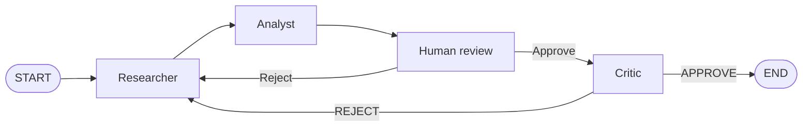

# Auto-Market-Research Swarm

Luồng nghiên cứu thị trường **tự trị** với **LangGraph**: ba AI agent (Researcher, Analyst, Critic) phối hợp thu thập dữ liệu, phân tích, vẽ biểu đồ và soát xét báo cáo — có **Human-in-the-Loop (HITL)** trước khi Critic chạy.

**Output kỳ vọng:** ứng dụng web (Streamlit) hiển thị tiến trình từng node, cho phép duyệt/từ chối giữa chừng, và trả về báo cáo text kèm biểu đồ PNG.

---

## Tổng quan

| Thành phần | Vai trò |
|------------|---------|
| **Researcher** | Tìm kiếm web (Tavily), tóm tắt khách quan, ghi nguồn — không khuyến nghị mua/bán |
| **Analyst** | Đọc `raw_data`, phân tích logic, gọi Python REPL vẽ biểu đồ (`charts/chart_output.png`) |
| **Human review (HITL)** | Dừng luồng, hiển thị preview; người dùng **Approve** hoặc **Reject** + feedback |
| **Critic** | Kiểm duyệt chất lượng; `APPROVE` → kết thúc, `REJECT` → quay lại Researcher (tối đa vòng revision) |



---

## Tech stack

- **Python 3.10+**
- **LangGraph** — orchestration, checkpoint, `interrupt()` / `Command(resume=...)`
- **LangChain** — messages, tools, structured output (Pydantic)
- **Google Gemini** (mặc định) hoặc **OpenAI** — LLM
- **Tavily API** — tìm kiếm web (`tavily-python`)
- **Python REPL** (`langchain-experimental`) — chạy matplotlib/pandas cục bộ
- **Pydantic v2** — schema đầu ra Researcher / Critic
- **Streamlit** — giao diện web
- **FastAPI + Uvicorn** — API tùy chọn (tách process UI / graph)

---

## Cấu trúc thư mục

```
enterprise-agentic-swarm/
├── src/amr_swarm/           # Core package (LangGraph)
│   ├── state_schema.py      # Module 1: AgentState + Pydantic
│   ├── tools_config.py      # Module 2: Tavily + Python REPL
│   ├── agents_logic.py      # Module 3: agent nodes + LLM
│   ├── llm_utils.py         # Retry 429, delay giữa các node
│   ├── graph_builder.py     # Module 4: StateGraph, HITL, checkpointer
│   └── paths.py             # charts/, data/ tại repo root
├── apps/
│   ├── streamlit_app.py     # Module 5: Streamlit UI
│   └── api.py               # Module 5: FastAPI
├── scripts/
│   └── demo_hitl_terminal.py
├── tests/
├── charts/                  # Biểu đồ PNG (runtime)
├── data/                    # SQLite checkpoint (nếu bật)
├── app.py                   # Wrapper: streamlit run app.py
├── api.py                   # Wrapper: uvicorn api:app
├── requirements.txt
├── pyproject.toml
├── .env.example
└── README.md
```

---

## Lộ trình 5 module (ánh xạ source code)

Dự án được chia theo lộ trình học/thực hành; mỗi module tương ứng file chính trong repo.

### Module 1 — State & Pydantic (`state_schema.py`)

Định nghĩa **state toàn cục** và model ép kiểu đầu ra:

- **`AgentState`** (`TypedDict`):
  - `messages` — lịch sử hội thoại (reducer `operator.add`)
  - `raw_data` — tóm tắt từ Researcher
  - `chart_path` — đường dẫn biểu đồ
  - `revision_count` — số lần bị Critic/HITL yêu cầu làm lại
  - `sender` — agent vừa chạy
  - `status` — `APPROVE` / `REJECT` từ Critic
- **`ResearcherOutput`** — `summary`, `sources`
- **`CriticDecision`** — `decision` (`APPROVE` | `REJECT`), `feedback`

### Module 2 — Tools (`tools_config.py`)

Hai tool bọc bằng `@tool`:

| Tool | Chức năng |
|------|-----------|
| `web_search_tool` | Gọi **Tavily** (retry mạng), trả text; đánh dấu `[SEARCH_FAILED]` khi lỗi |
| `python_sandbox_tool` | Thực thi code Python cục bộ qua `PythonREPLTool`; bắt exception, không crash graph |

Biểu đồ mặc định: `charts/chart_output.png`.

### Module 3 — Agents (`agents_logic.py`)

| Node | Hành vi |
|------|---------|
| `researcher_node` | Gọi Tavily **một lần** → LLM structured output → ghi `raw_data` |
| `analyst_node` | Tool loop với `python_sandbox_tool` (tối đa 2 vòng); bỏ qua vẽ đồ nếu search thất bại |
| `human_review_node` | `interrupt()` — chờ Approve/Reject từ UI hoặc API |
| `critic_node` | Structured output `CriticDecision`; không dùng tool |

**LLM:** Gemini (`GOOGLE_API_KEY`) hoặc OpenAI (`OPENAI_API_KEY`). Tên `gemini-1.5-flash` trong `.env` được **map** sang `gemini-flash-latest` vì API Google đã gỡ model 1.5. Có chuỗi fallback model khi 429/404.

**Lưu ý Gemini:** mọi request phải có cặp `SystemMessage` + `HumanMessage` (tránh lỗi `contents are required`).

### Module 4 — Graph & HITL (`graph_builder.py`, `demo_hitl_terminal.py`)

Luồng thực tế (khác một chút so với prompt gốc chỉ có 3 node):

```
START → researcher → analyst → human_review → critic
                              ↑                    │
                              └──── REJECT ────────┘
critic APPROVE → END
```

- **HITL:** node `human_review` dùng `interrupt()` thay vì `interrupt_before=['critic']`, để Streamlit gửi `Command(resume={"action": "approve"|"reject", "feedback": "..."})` có cấu trúc.
- **Checkpointer:** `InMemorySaver` (mặc định) hoặc `SqliteSaver` (`AMR_CHECKPOINTER=sqlite` → `data/checkpoints.db`).
- **Demo terminal:** `python demo_hitl_terminal.py`

### Module 5 — UI & API (`app.py`, `api.py`)

**Streamlit (`app.py`):**

- Sidebar: nhập mã CP/câu hỏi, **Chạy phân tích**, **Luồng thread mới**
- `st.status` — stream từng node khi graph chạy
- Khi interrupt: **Duyệt (Approve)** / **Yêu cầu sửa (Reject)** + feedback
- Hiển thị `raw_data`, biểu đồ, trạng thái Critic

**FastAPI (`api.py`)** — bật khi `AMR_USE_API=1`:

| Method | Endpoint | Mô tả |
|--------|----------|--------|
| `POST` | `/runs/start` | Bắt đầu phân tích (`query`, `thread_id`) |
| `GET` | `/runs/{thread_id}/state` | Lấy state + interrupts |
| `POST` | `/runs/{thread_id}/resume` | Approve / reject |
| `GET` | `/health` | Health check |

---

## Cài đặt

```bash
cd enterprise-agentic-swarm
python -m venv .venv

# Windows
.venv\Scripts\activate

# macOS / Linux
source .venv/bin/activate

pip install -r requirements.txt
pip install -e .
cp .env.example .env
```

Chỉnh `.env`:

```env
TAVILY_API_KEY=tvly-...
GOOGLE_API_KEY=...
AMR_LLM_PROVIDER=gemini
AMR_GEMINI_MODEL=gemini-1.5-flash
```

Cần truy cập được **`api.tavily.com`** (DNS/mạng). Kiểm tra: `nslookup api.tavily.com`.

---

## Chạy ứng dụng

### Streamlit (mặc định — graph trong cùng process)

```bash
streamlit run app.py
# hoặc: streamlit run apps/streamlit_app.py
```

Mở trình duyệt, nhập câu hỏi (vd. *Phân tích nhanh cổ phiếu FPT*), bấm **Chạy phân tích**.

### FastAPI + Streamlit (tách service)

Terminal 1:

```bash
uvicorn api:app --reload --host 127.0.0.1 --port 8000
# hoặc: uvicorn apps.api:app --reload --host 127.0.0.1 --port 8000
```

Terminal 2 — trong `.env`:

```env
AMR_USE_API=1
AMR_API_BASE=http://127.0.0.1:8000
```

```bash
streamlit run app.py
```

### HITL trên terminal

```bash
python scripts/demo_hitl_terminal.py
```

---

## Luồng sử dụng (người dùng)

1. Nhập **mã cổ phiếu / ngành / câu hỏi** → **Chạy phân tích**.
2. Theo dõi: `researcher` → `analyst` → dừng tại **human_review**.
3. Xem preview Analyst và biểu đồ (nếu có).
4. **Duyệt** → chạy **Critic** → báo cáo cuối.  
   **Từ chối** + feedback → quay lại Researcher (tăng `revision_count`).
5. Nếu thấy `[SEARCH_FAILED]` hoặc lỗi Tavily: **Luồng thread mới**, sửa mạng/key, chạy lại — không nên duyệt báo cáo chỉ mô tả lỗi API.

---

## Biến môi trường

| Biến | Mặc định | Mô tả |
|------|----------|--------|
| `TAVILY_API_KEY` | — | Bắt buộc cho tìm kiếm web |
| `GOOGLE_API_KEY` | — | Gemini Developer API |
| `AMR_LLM_PROVIDER` | `gemini` | `gemini` \| `openai` \| auto |
| `AMR_GEMINI_MODEL` | `gemini-1.5-flash` | Tên cấu hình; có thể map sang model API mới |
| `AMR_GEMINI_FALLBACK_MODELS` | `gemini-2.0-flash,...` | Fallback khi 429/404 |
| `AMR_OPENAI_MODEL` | `gpt-4o-mini` | Khi dùng OpenAI |
| `AMR_CHECKPOINTER` | `memory` | `memory` \| `sqlite` |
| `AMR_USE_API` | `0` | `1` = Streamlit gọi FastAPI |
| `AMR_LLM_DELAY_SEC` | `3` | Nghỉ giữa các node (free tier) |
| `AMR_TAVILY_MAX_RETRIES` | `3` | Retry khi lỗi mạng Tavily |

Xem đầy đủ trong [`.env.example`](.env.example).

---

## Xử lý sự cố

| Triệu chứng | Nguyên nhân thường gặp | Cách xử lý |
|-------------|------------------------|------------|
| `contents are required` | Gemini thiếu `HumanMessage` | Đã xử lý trong `agents_logic._gemini_chat_messages`; restart app |
| `404 NOT_FOUND` model Gemini | `gemini-1.5-flash` đã gỡ | Giữ tên trong `.env` (auto map) hoặc đặt `gemini-flash-latest` |
| `429` / `RESOURCE_EXHAUSTED` | Hết quota free tier | Đợi ~1 phút; đổi `AMR_GEMINI_FALLBACK_MODELS` |
| `[SEARCH_FAILED]` / `ConnectionError` Tavily | DNS/mạng tới `api.tavily.com` | Kiểm tra key, firewall, VPN; chạy lại thread mới |
| Analyst mô tả “tỷ lệ lỗi 100%” | Phân tích chuỗi lỗi API thay vì dữ liệu CP | Reject / thread mới sau khi Tavily ổn |

---

## Giấy phép & ghi chú

Dự án học tập **LangChain Academy** — Enterprise Agentic Swarm.  
Không phải lời khuyên đầu tư; dữ liệu phụ thuộc nguồn Tavily và chất lượng LLM.

---

## Tài liệu tham khảo

- [LangGraph](https://langchain-ai.github.io/langgraph/)
- [LangChain Tools](https://python.langchain.com/docs/concepts/tools/)
- [Tavily API](https://docs.tavily.com/)
- [Google Gemini API](https://ai.google.dev/gemini-api/docs)
